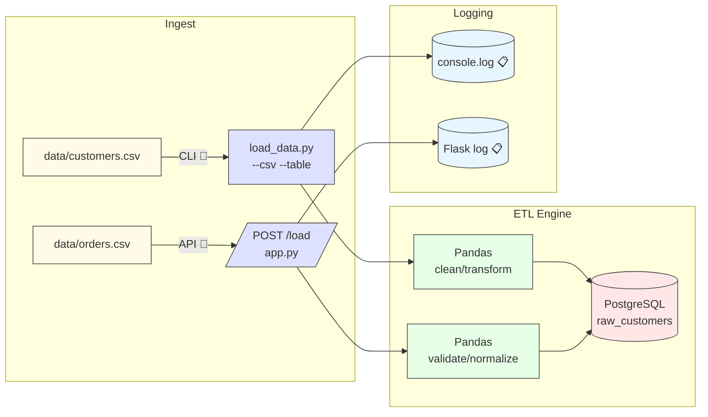

# 📦 CSV-to-Database ETL Pipeline

[](https://www.python.org/)
[](LICENSE)
[](https://github.com/poloman2308/csv-to-db-pipeline/actions)
[](https://github.com/poloman2308/csv-to-db-pipeline)

A lightweight data engineering pipeline that loads CSV files into a PostgreSQL database using **Python, Pandas, SQLAlchemy**, and exposes a triggerable **Flask API**.

---

## 🚀 Features

- CLI and API-based CSV ingestion
- Data transformation via Pandas
- Loads into PostgreSQL using SQLAlchemy
- Logging for all ETL events
- `.env`-based configuration
- Containerized PostgreSQL support via Docker

---

## 🧱 Project Structure

```plaintext
csv_to_db_pipeline/
├── api/               # Flask API to trigger pipeline
│   └── app.py
├── etl/               # Core ETL logic
│   └── load_data.py
├── data/              # Sample or target CSV files
├── test_request.py    # Script to test the API locally
├── .env               # DB connection credentials (not committed)
├── .gitignore
├── requirements.txt
└── README.md
```

---

## 📊 End-to-End Flow Diagram



---

## 📚 Component Glossary

| Component           | Description                                                                            |
| ------------------- | -------------------------------------------------------------------------------------- |
| `data/*.csv`        | Raw CSV files containing structured data to ingest                                     |
| `etl/load_data.py`  | CLI-driven ETL script that reads CSVs, transforms with Pandas, and loads to PostgreSQL |
| `api/app.py`        | Flask-based REST API that triggers the same ETL pipeline via HTTP requests             |
| `test_request.py`   | Script to test the API endpoint locally using `requests.post()`                        |
| `.env`              | Stores database connection variables (`DB_USER`, `DB_PASS`, etc.)                      |
| `requirements.txt`  | Python package dependencies for ETL and API                                            |
| `PostgreSQL`        | Target database to persist ingested and transformed records                            |
| `logging`           | Console and API logs to track ETL runs and errors                                      |
| `Docker` (optional) | Containerized PostgreSQL setup for local development and testing                       |

---

## ⚙️ .env Format

```yaml
DB_USER=dbt_user
DB_PASSWORD=dbt_pass
DB_NAME=ecommerce
DB_HOST=localhost
DB_PORT=5433
```
> 🔐 This file should be excluded from Git (.gitignore).

---

## 🖥️ Run Locally

```
python etl/load_data.py --csv data/customers.csv --table raw_customers
python etl/load_data.py --csv data/orders.csv --table raw_orders
python etl/load_data.py --csv data/products.csv --table raw_products
```

---

## ▶️ Flask API:

```bash
python api/app.py
```

---

## 🔁 Make a request:

```
curl -X POST http://localhost:5000/load \
     -H "Content-Type: application/json" \
     -d "{\"csv_path\": \"data/customers.csv\", \"table_name\": \"raw_customers\"}"
```

---

## 🐳 Optional: Start PostgreSQL via Docker

```bash
docker run --name etl-postgres -e POSTGRES_USER=dbt_user -e POSTGRES_PASSWORD=dbt_pass -e POSTGRES_DB=ecommerce -p 5433:5432 -d postgres:15
```

---

## ✅ Example Response

```json
{
  "message": "Loaded data/customers.csv into raw_customers"
}
```

---

## 🚧 Future Enhancements

Here are a few directions to expand and productionize this project:

| Enhancement                     | Description                                                              |
| ------------------------------- | ------------------------------------------------------------------------ |
| 🕒 Schedule ETL Runs            | Use `cron`, `Airflow`, or `Prefect` to automate periodic ingestion       |
| 🧪 Add Unit & Integration Tests | Use `pytest` to validate data types, transformations, and DB inserts     |
| 📉 Data Validation Layer        | Add `pandera` or `great_expectations` for schema and quality checks      |
| ☁️ Cloud Integration            | Push data to cloud databases (e.g., AWS RDS) or cloud storage (e.g., S3) |
| 📊 Dashboarding                 | Connect PostgreSQL to BI tools like Power BI or Metabase                 |
| 🐳 Full Dockerization           | Package API, ETL, and DB as containers using Docker Compose              |
| 🧵 Parallel File Loading        | Enable concurrent CSV ingestion for large datasets                       |
| ⛓️ Change Data Capture (CDC)    | Track and load only new/changed records from source files                |
| 🔐 Role-Based Access            | Add auth to restrict API usage in production                             |
| 🔁 Incremental Loads            | Add logic to detect and skip already-loaded rows                         |

---

## ✍️ Author

**Derek Acevedo**  
📍 [GitHub](https://github.com/poloman2308)  
📄 [LinkedIn](https://www.linkedin.com/in/derekacevedo86)


